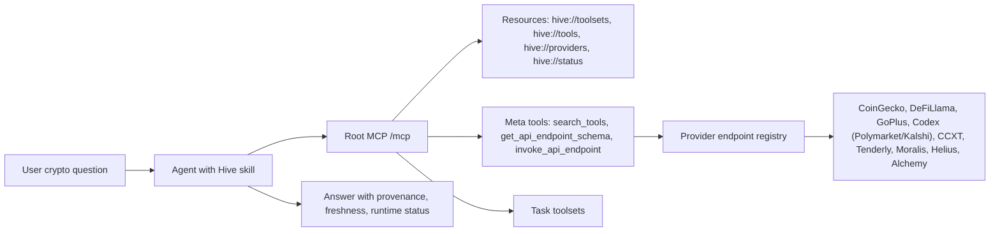

# Hive Root MCP Workflow

Hive is an agent-facing crypto intelligence product, not a flat endpoint
catalog. The root MCP endpoint stays compact so agents can decide quickly and
only pull deeper schemas when needed.

## Architecture

## Default agent loop

1. Start from user intent, not provider names.
2. Read `hive://toolsets` or call `search_tools`.
3. Select the closest task toolset.
4. Ask for required identifiers that are missing: chain, wallet, contract,
   token id, pair id, protocol slug, market id, or time window.
5. Call `get_api_endpoint_schema` for each exact endpoint before execution.
6. Call `invoke_api_endpoint` with bounded arguments. Respect `limit`,
   `page`, `per_page`, `offset`, time windows, and response-size safeguards.
7. Report provider, freshness, fallback/degraded state, missing keys, rate
   limits, and caveats.

## Root versus category endpoints

- Root `/mcp` should expose a small meta-tool surface. It is optimized for
  agents that need routing, schema lookup, and bounded invocation.
- Category endpoints expose direct scoped tools for clients that explicitly
  need broad `tools/list` results.
- Do not treat root `tools/list` as the full product. Full provider coverage is
  discoverable through resources, category listing tools, schema lookup, and
  `invoke_api_endpoint`.

## Reporting standard

Every answer that used Hive should include enough context to debug the result:

- Toolset or endpoint used.
- Provider or data source.
- Chain/network and identifiers.
- Freshness or timestamp if available.
- Runtime state: `ok`, `missing_key`, `plan_required`, `rate_limited`,
  `degraded`, or `failing`.
- Any fallback, cache use, unavailable provider, or omitted data.
