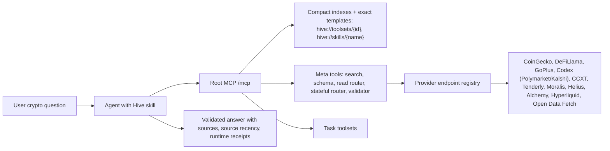

# Hive Root MCP Workflow

Hive is an agent-facing crypto intelligence product, not a flat endpoint
catalog. The root MCP endpoint stays compact so agents can decide quickly and
only pull deeper schemas when needed.

## Architecture

## Default agent loop

1. Start from user intent, not provider names.
2. Read the compact `hive://toolsets` index or call `search_tools`. Search
   returns at most three compact toolsets by default and paginates tools and
   toolsets separately.
3. Select the closest task toolset and its one best matching compact
   `routes[]` entry. Preserve `route_id`; use `coverageCatalog` only for
   long-tail discovery, never as a call list.
4. Ask for the route's required identifiers that are missing: chain, wallet, contract,
   token id, pair id, protocol slug, market id, or time window.
5. Call `get_api_endpoint_schema` for each exact endpoint before execution.
6. Call reads through `invoke_api_endpoint` with bounded arguments. For a
   Hive-native write, explain the effect, obtain explicit user approval, and
   use `invoke_stateful_endpoint`. Respect `limit`, `page`, `per_page`,
   `offset`, time windows, and response-size safeguards.
7. Follow the route's ordered primary calls, conditional per-call fallbacks,
   four-call cap, and stop condition. Never call every fallback by default.
8. Copy each material response's `_hive` block into the task receipt, call
   `validate_task_result` with `route_id`, and report provider, source recency,
   fallback/degraded state, missing evidence, and caveats. Structural
   validation does not authenticate invented receipts.

## Root versus category endpoints

- Root `/mcp` exposes five tools: compact search, schema lookup, separate
  read/write routers, and task-result validation.
- Category endpoints expose direct scoped tools for clients that explicitly
  need broad `tools/list` results.
- Do not treat root `tools/list` as the full product. Full provider coverage is
  discoverable through resources, hidden compatibility listings, scoped
  category endpoints, schema lookup, and
  `invoke_api_endpoint` for reads or `invoke_stateful_endpoint` for explicitly
  approved Hive state changes.

## Reporting standard

Every answer that used Hive should include enough context to debug the result:

- Toolset or endpoint used.
- Provider or data source.
- Chain/network and identifiers.
- Source recency from provider time, block, slot, transaction, or candle close.
  `_hive.observed_at` is Hive first-observation/original cache time;
  `cache_age_ms: 0` does not prove upstream freshness. Mark source recency
  unknown when no provider marker exists.
- Runtime state: `ok`, `invalid_input`, `missing_key`, `plan_required`,
  `rate_limited`, `degraded`, or `failing`.
- Any fallback, cache use, unavailable provider, or omitted data.
- Server-minted receipt IDs for every material call plus the
  `validate_task_result` outcome.
- A `claims[]` citation for each material statement and one `coverage[]`
  entry for every canonical evidence phase, including explicit gaps.
- Server/build version and input/result SHA-256 self-checks when present. These
  digests are not signatures.
